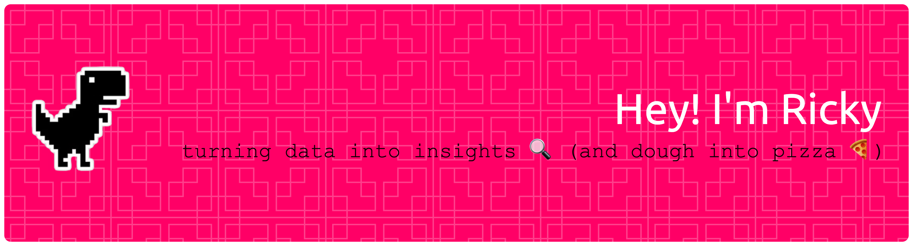

# 💫 About Me:
🔭 I’m currently working on a multi-agent system to help me with my fantasy leagues 👯 I’m looking to collaborate on data projects using dbt 🤝 I’m looking for help with debugging agent workflows 🌱 I’m currently learning about agents 💬 Ask me about joining event and tracking tables in football matches ⚡ Fun fact: Aspiring pizzaiolo 🍕

## 🌐 Socials:
 

# 💻 Tech Stack:
              
# 📊 GitHub Stats:
 
 

<!-- Proudly created with GPRM ( https://gprm.itsvg.in ) -->
